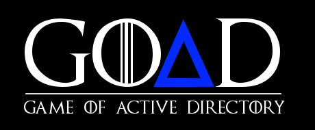

# GOAD-Attacks

     

    

Below are some of the <b>Game of Active Directory (GOAD)</b> attack <b>write ups</b> I found useful in exploring my <b>GOAD Lab</b> instance. My GOAD Install writeup can be found [here](https://github.com/jjkirn/GOAD). 

The first 2 are just for <b>GOAD-Light</b> while the last 2 are for the full <b>GOAD</b> install.

1. <b>HacktheClown</b> (@hacktheclown) has a series of <b>10 youtube.com videos </b>that show you how to perform AD attacks on a <b>GOAD-Light</b> instance:

- [AD Attacks using GOAD-Light](https://youtube.com/playlist?list=PL08nYpWQJ_zM4JxekcckBVjglpVWgg2u0)

2.	<b>Cyb3rByte</b> has a 3 part series on [Medium](https://cyb3rbyte.medium.com/) covering <b>GOAD-Light</b>:

- [GOAD Part 1: Scanning the Forest - Reconnaissance in an Active Directory Jungle](https://cyb3rbyte.medium.com/goad-part-1-scanning-the-forest-reconnaissance-in-an-active-directory-jungle-53a125bd2486 )

- [GOAD Part 2: When Enumeration Bites Back - From SMB to R.I.P.](https://cyb3rbyte.medium.com/goad-part-2-when-enumeration-bites-back-from-smb-to-r-i-p-ee7708c98b7d )

- [GOAD Part 3: The Art of Extraction - Roasting and Poisoning for Domain Dominance](https://cyb3rbyte.medium.com/goad-part-3-the-art-of-extraction-roasting-and-poisoning-for-domain-dominance-240aa6490dd1 )

3.	<b>Moe</b> (@FAMASoon) has 4 good write-ups for attacking a full <b>GOAD</b> instance, but they are in Japanese. You will need google translate to view them in English.

- [GOAD Writeup Ch1](https://x64.moe/posts/goad_writeupch1/ )

- [GOAD Writeup Ch2](https://x64.moe/posts/goad_writeupch2/ )

- [GOAD Writeup Ch3](https://x64.moe/posts/goad_writeupch3/ )

- [GOAD Writeup Ch4](https://x64.moe/posts/goad_writeupch4/ )

4. <b>Game of Active Directory (GOAD)</b> V2 and now V3

- Mayfly (@Mayfly)  discord: m4yfly
- https://mayfly277.github.io/ 
- Github: https://github.com/Orange-Cyberdefense/GOAD 
- Doc: https://orange-cyberdefense.github.io/GOAD/

<b>mayfly</b> is the author (along with others) that created the Game of Active Directory - [GOAD project]( https://github.com/Orange-Cyberdefense/GOAD ). This team also created the following attacks on GOAD.

- [GOAD - part 1 - reconnaissance and scan](https://mayfly277.github.io/posts/GOADv2-pwning_part1/ )

- [GOAD - part 2 - find users](https://mayfly277.github.io/posts/GOADv2-pwning-part2/ )

- [GOAD - part 3 - enumeration with user](https://mayfly277.github.io/posts/GOADv2-pwning-part3/ )

- [GOAD - part 4 - poison and relay](https://mayfly277.github.io/posts/GOADv2-pwning-part4/ )

- [GOAD - part 5 - exploit with user](https://mayfly277.github.io/posts/GOADv2-pwning-part5/ )

- [GOAD - part 6 – ADCS](https://mayfly277.github.io/posts/GOADv2-pwning-part6/ )

- [GOAD - part 7 – MSSQL](https://mayfly277.github.io/posts/GOADv2-pwning-part7/ )

- [GOAD - part 8 - Privilege escalation](https://mayfly277.github.io/posts/GOADv2-pwning-part8/ ) 

- [GOAD - part 9 - Lateral move](https://mayfly277.github.io/posts/GOADv2-pwning-part9/ )

- [GOAD - part 10 - Delegations](https://mayfly277.github.io/posts/GOADv2-pwning-part10/ )

- [GOAD - part 11 - ACL](https://mayfly277.github.io/posts/GOADv2-pwning-part11/ )

- [GOAD - part 12 - Trusts](https://mayfly277.github.io/posts/GOADv2-pwning-part12/ )

Some of these attacks are out-of-date and need to be updated. An example is <b>cme </b> is outdated and we should use <b>nxc</b>. Also, <b>nxc</b> has options that <b>cme</b> doesn't. Check out Cyb3rByte 3 part series and you will get an idea of what I and referring to.

That being said, these 12 attacks were updated in 2024 and are still very useful.

## Now Ready for attacks using Kali ?